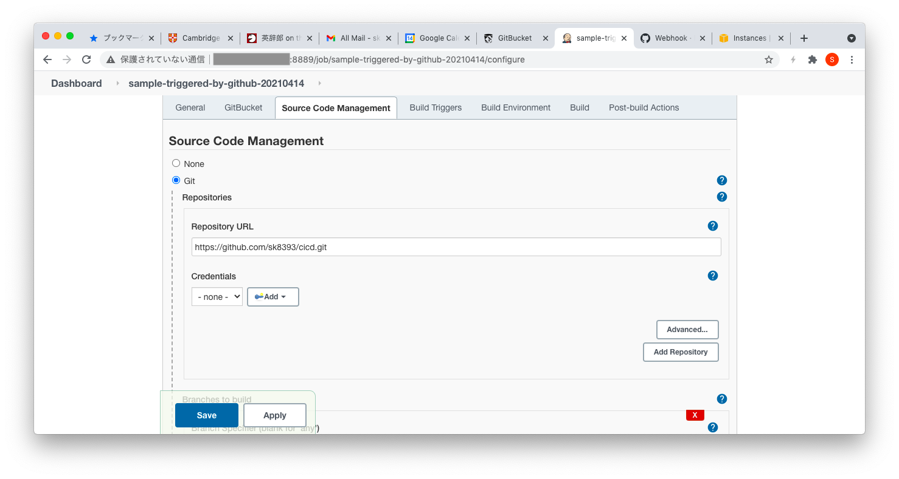
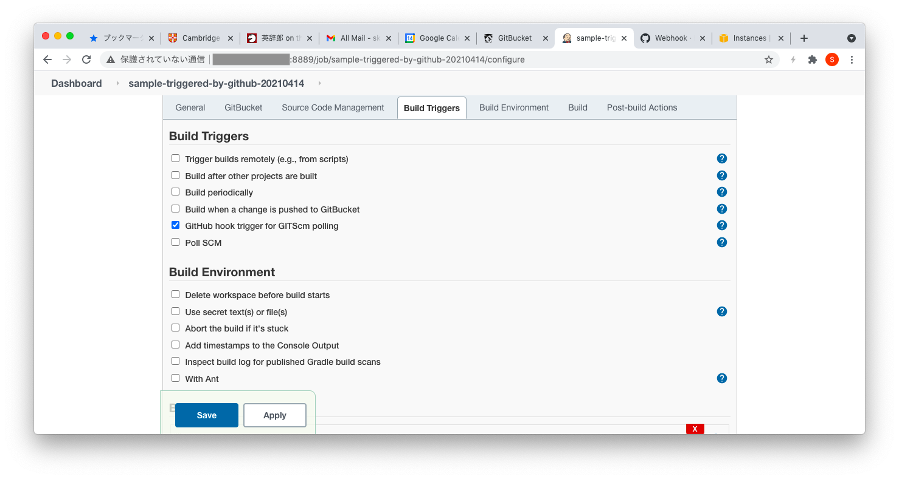
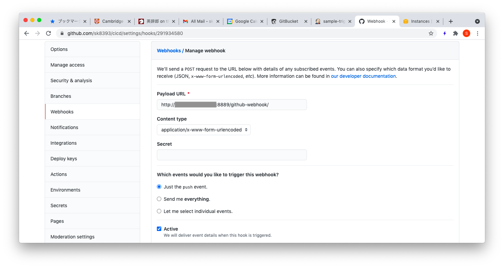

# cicd

jenkins_repository_url_masked

jenkins_build_triggers_masked

github_payload_url_masked

140.82.112.0/20 and 192.30.252.0/22 have to be accepted as source IP of webhook from GitHub.
[Webhooks IP changes - GitHub Changelog](https://github.blog/changelog/2019-04-09-webhooks-ip-changes/)
